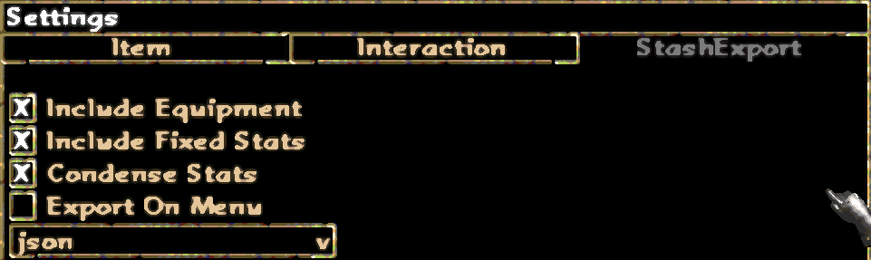

# PD2Sales by Claessic
Sales Manager for Project Diablo 2

This is not a replacement for the trade website they've been working on for a while, but hopefully this will make trading easier for a lot of us. It's meant to be efficient and easily usable.

How to use:
1. [Download](https://github.com/ClaessicsGit/PD2Sales/blob/main/Newest%20Build/PD2Sales.exe) 
or build the newest release and place it in your Diablo2/ProjectD2/Stash folder.
2. Open PD2 and enter a game with your character. 
3. Open the "Settings" 

4. Go to the "Export Stash" tab and set your settings like this:

You can enable "Export on Menu" to export your stash every time you hit esc, if you want. It can cause a bit of stutter during gameplay though, so it's not recommended.
5. Close the settings tab.
6. Press "numpad 5" or esc if you turned on Export on Menu. You should see a notification that your character stash has been exported. It should look like this:

7. Open PD2Sales.exe in the Diablo2/ProjectD2/Stash folder. You should now be able to navigate through your items by categories. It should look like this:

8. To add an item for select, select it in the "Items" column and click a rune, the offer button or the high rune button.
9. Clicking the same price twice increases the amount you want for the item, like this:

10. To decrease the price of the item, right-click the price. If amount reaches 0, it'll be removed.
11. Item can also be removed by selecting it in the "Sales" column and clicking the remove button below.
12. Now it gets interesting. The exports are currently not working correctly, so some of the stats are exported incorrectly. To circumvent this issue, I added editable details for the item. Double-click an item in the sales window, and you'll see your options. It should look like this:

13. Edit the details to your liking. Toggle each stat on/off for export. Green means it will get exported, red means it's skipped. You can write what you want in the "Append" field, and it'll get written after your item in the export file. You can see an example below.
14. This step is important. When you're done, click the "Save and Export" button.
15. An export can now be found in Diablo2/ProjectD2/Stash folder. Look for "SalesExport_ByRune.txt. I'll be adding different outputs later, but for now they're sorted by rune.
16. If you remembered to save and export, PD2Sales will save your settings and automatically load them the next time you open the application.

I'm sure there are some bugs, feel free to report them and I'll get around to fixing it eventually. I'll also make the exports prettier.

Happy trading!

-Claessic
